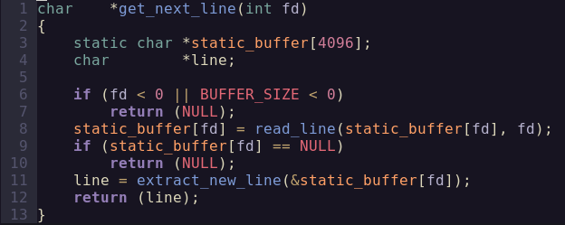

**Tags:** [[static variables]] [[memory management]] [[file manipulation]]
**Status:** #done 
# Project

The project consists in a function called get_next_line that will be used to read the content of a file returning **one line at a time**. This function will later be added to libft to be used in future projects.

- #### [repo](https://github.com/ytower-bot/get_next_line)
- #### [subject](https://cdn.intra.42.fr/pdf/pdf/146982/en.subject.pdf)

# Mandatory Part

Implement the ``get_next_line`` function, which reads and returns one line at a time from a given file descriptor. The function should return the line, including the newline character (`\n`), unless the end of the file is reached without it. If there's nothing left to read or an error occurs, it should return `NULL`. The function must handle repeated calls to read the file continuously and work for both file inputs and standard input. The project requires the use of ``read``, ``malloc``, and ``free``, and you must provide your implementation across three files: ``get_next_line.c`` (main function), ``get_next_line_utils.c`` (helper functions), and ``get_next_line.h`` (header with the prototype).

- ## Concepts
	- #### Static variables
		A static variable is a variable that keeps its value between multiple function calls. It is initialized once (and is 0 by default) and persists until the end of the program's execution
	- #### File manipulation
		For this project, we're going to need to understand the basics of file manipulation. We will have to know how to open and close a file, as well as reading its content. In order to do that, we will use the following [[syscalls]]:
		
			open(), close() and read()

Now that we know everything that's new. Let's see how the code looks like.

# Reading the content of the file

Since our program must be able to return one line at a time, we will have to read the content of the file in *chunks* of bytes, while looking for a newline.

Once it finds a newline, it stops reading the file and returns the block of text read by the function. However, if it doesn't find a newline, it stores the bytes read in a static variable and loops again.

# Extracting the line from the buffer

The name of this function is self-explanatory. It simply searches for a newline in the buffer and returns it, from the start up to the first newline it encounters.

Additionally, it will remove the the returned part and keep the rest of string in the same variable, taking the pointer to the first character right after the end of the line just returned.

# Bonus part

The bonus of this project consists in having a way of handling multiple file descriptors at the same time, as well as using only one static variable. Since we're already using just one static variable, the only thing that we have to do is adjust our main function to handle multiple file descriptors.

## References
mostly man 3 and chat gpt
geeks for geeks on [static variables](https://www.geeksforgeeks.org/static-variables-in-c/)
and also [this video](https://www.youtube.com/watch?v=8E9siq7apUU)
